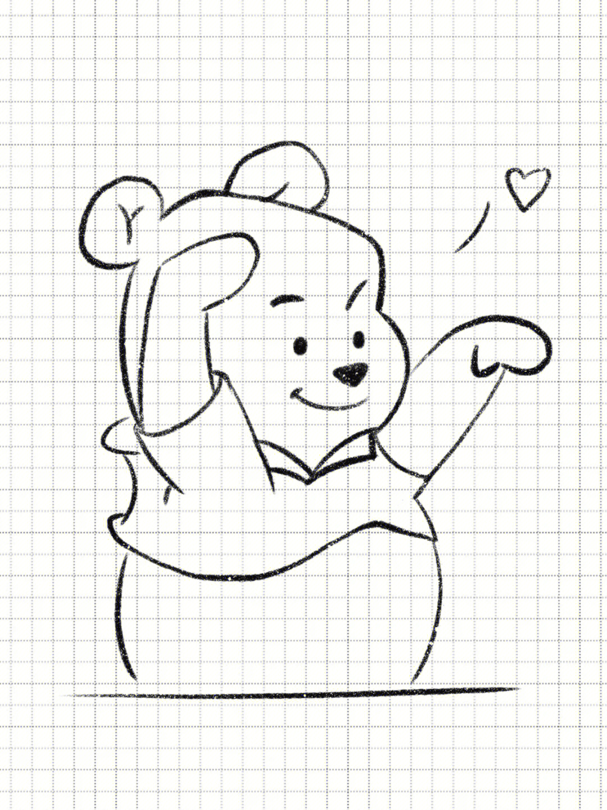

# Hi there 👋
## Hi there 👋
### Hi there 👋

***
*斜体* 
---
_斜体_
**粗体**
***粗斜体*** 
***
1. 第一:
    * 第一
    * 第二
3. 第一:
    * 第一
    * 第二
***
>1
>>2
>>>3
***
| 表头 | 表头 |
| --- | --- |
| A | B |
| C | D |
<!--
**something951/something951** is a ✨ _special_ ✨ repository because its `README.md` (this file) appears on your GitHub profile.

Here are some ideas to get you started:

- 🔭 I’m currently working on ...
- 🌱 I’m currently learning ...
- 👯 I’m looking to collaborate on ...
- 🤔 I’m looking for help with ...
- 💬 Ask me about ...
- 📫 How to reach me: ...
- 😄 Pronouns: ...
- ⚡ Fun fact: ...
-->
